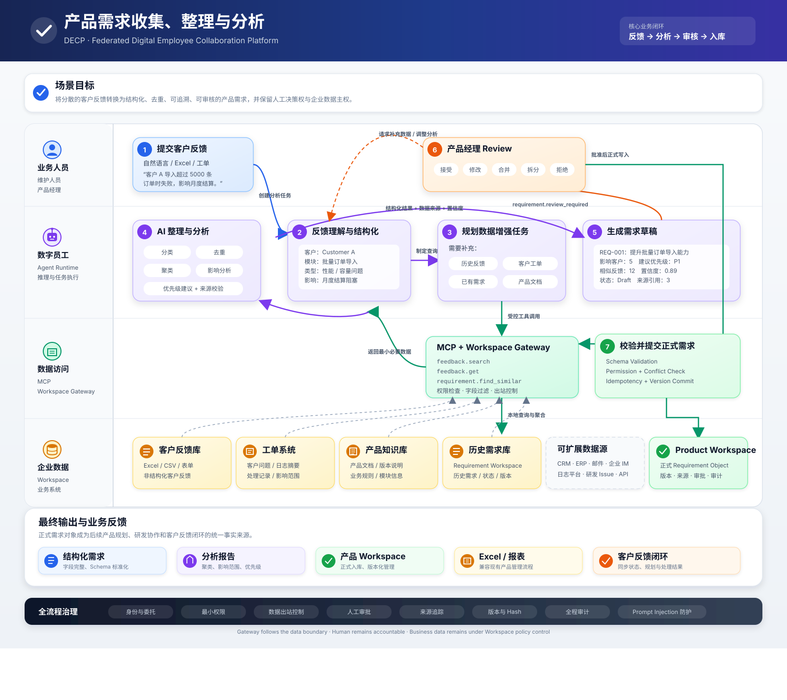

# DECP 白皮书

**DECP · 联邦数字员工协作平台**（Federated Digital Employee Collaboration Platform）

> 将分散的客户反馈转换为 **结构化、去重、可追溯、可审核** 的产品需求，同时保留**人工决策权**与**企业数据主权**。

*版本 0.1.0 · MIT License · © 2026 shark8848*

---

## 1. 问题背景

企业产品团队每天从多渠道接收客户反馈：自然语言、Excel、工单系统、销售会话。这些反馈天然存在三个问题：

- **非结构化** —— 散落在邮件、表格、工单中，无统一 Schema，无法被分析系统消费；
- **重复与噪音** —— 同一问题被不同客户反复上报，真实需求被淹没；
- **不可追溯** —— 从客户原话到正式需求之间缺少来源引用与审核记录。

传统做法依赖人工整理，成本高、周期长、口径不一；完全自动化又难以保留**人工决策权**（产品经理对需求取舍的判断）与**企业数据主权**（客户数据不出域、出站可控）。

## 2. 设计目标

| 目标 | 含义 |
| --- | --- |
| **结构化** | 自由文本 → 标准字段（客户 / 模块 / 类型 / 影响 / 严重度） |
| **去重** | 相似反馈聚合，识别真实需求规模 |
| **可追溯** | 每条正式需求携带来源引用（feedback → requirement） |
| **可审核** | 人工 Review 环节，接受 / 修改 / 合并 / 拆分 / 拒绝 |
| **数据主权** | 客户数据仅在受控网关内流转，出站受权限检查与审计 |

## 3. 场景架构

DECP 按设计文档实现产品需求收集、整理与分析场景的**四层架构**：

> **业务人员**（业务 / 维护 / 产品经理）→ **数字员工**（Agent Runtime）→ **数据访问**（MCP Workspace Gateway）→ **企业数据**（Product Workspace）

```
┌─────────────────────────────────────────────┐
│ 数字员工 Agent / Skill 层（decp_core.agent）   │
│  · 技能：requirement_analysis / query          │
│  · 工具调用双模式：direct（进程内）/ client（跨进程）│
├─────────────────────────────────────────────┤
│ MCP 工具层（decp_core.mcp_）                   │
│  · 23 个 tools：feedback.* / requirement.*     │
│    / report.* / domain.* / workspace.*        │
│  · 传输：stdio（默认）/ streamable http         │
├─────────────────────────────────────────────┤
│ 企业数据层 Service（decp_core.services）        │
│  · FeedbackService / RequirementService /        │
│    WorkspaceService（多租户隔离）                 │
│  · 整理分析：分类/去重/聚类/影响/优先级/来源校验    │
├─────────────────────────────────────────────┤
│ 存储层（decp_core.storage）                    │
│  · StorageBackend 抽象 + SQLite / Postgres     │
└─────────────────────────────────────────────┘
```

## 4. 核心业务闭环（七步）



| 步骤 | 名称 | 说明 |
| --- | --- | --- |
| 1 | **提交客户反馈** | 自然语言 / Excel / 工单，如「客户 A 导入超过 5000 条订单时失败，影响月度结算」 |
| 2 | **反馈理解与结构化** | 抽取客户 / 模块 / 类型 / 影响，形成标准字段 |
| 3 | **规划数据增强任务** | 制定查询计划：历史反馈、客户工单、已有需求、产品文档 |
| 4 | **AI 整理与分析** | 通过 MCP + Workspace Gateway 受控调用：分类、去重、聚类、影响分析、优先级 |
| 5 | **生成需求草稿** | 依据分析结果生成 REQ 草稿，携带影响客户数 / 优先级 / 相似反馈数 / 置信度 |
| 6 | **产品经理 Review** | 人工审批：接受 / 修改 / 合并 / 拆分 / 拒绝 |
| 7 | **校验并提交正式需求** | Schema Validation → Permission + Conflict Check → Idempotency + Version Commit，写入 Product Workspace |

### 数据源（步骤 3 的可扩展接入）

- **客户反馈库**：Excel / CSV / 表单，非结构化客户反馈
- **工单系统**：客户问题 / 日志摘要 / 处理记录 / 影响范围
- **产品知识库**：产品文档 / 版本说明 / 业务规则 / 模块信息
- **历史需求库**：Requirement Workspace，历史需求 / 状态 / 版本
- **可扩展**：CRM · ERP · 邮件 · 企业 IM · 日志平台 · 研发 Issue · API

### 最终输出

| 输出 | 说明 |
| --- | --- |
| **结构化需求** | 字段完整、Schema 标准化 |
| **分析报告** | 聚类、影响范围、优先级 |
| **产品 Workspace** | 正式入库、版本化管理 |
| **Excel / 报表** | 兼容现有产品管理流程 |

## 5. 技术实现

### 双数据域

- **feedback 域**：客户反馈，结构化抽取后入库存档；
- **requirement 域**：正式需求对象，携带版本 · 来源 · 审批 · 审计。

### 双存储后端

- **SQLite**（默认，零依赖，WAL 模式）—— 开发 / 单机；
- **PostgreSQL**（psycopg3 连接池，JSONB 结构化字段，TIMESTAMPTZ）—— 生产形态。

### 工具调用双模式

- **direct**（进程内）—— 测试 / 演示 / 单进程部署；
- **client**（跨进程，MCP 客户端连接 stdio / http）—— 外部 Agent Runtime 集成。

### 关键设计决策

- **去重 / 聚类**：字符 n-gram 相似度（2-gram / 3-gram Dice + 公共子串），对中文同义改写 / 标点 / 插入鲁棒且确定性；去重阈值 0.28、聚类阈值 0.24（依据真实反馈分布校准）。
- **人工决策保留**：需求正式入库必须经过产品经理 Review（accept / merge / reject），审批人 / 时间落库。
- **归档（软归档）**：已审核完结需求（accepted / rejected / merged）可归档移出活跃视图，默认查询过滤、可恢复；未审核（draft / reviewing）不可归档，保证归档不越人工审批边界。
- **来源追溯**：每条需求携带 `source_ref`（反馈 id / 工单号），保证可追溯。
- **出站控制**：MCP Gateway 层做权限检查 · 字段过滤 · 出站控制，客户数据不越域。
- **多工作区隔离（multi-tenancy）**：`user` / `workspace` / `workspace_member` 三表 + `feedback` / `requirement` 的 `workspace_id` 列实现产品维度隔离。每个用户可创建多个产品 workspace，他人申请加入由 owner 审批；所有数据读写按调用者 workspace 强制过滤，非成员拒绝。身份来源为 MCP ctx meta / 显式参数，默认工作区 `default` 兜底存量数据，单租户行为不变。

## 6. 分发与安装

DECP 以 Python 包与 npm 包双通道分发：

| 通道 | 包名 | 用途 |
| --- | --- | --- |
| PyPI | `decp-core` | 数据层 / 业务集成（`pip install decp-core`） |
| npm | `@shark8848/decp-core` | skills + MCP server 启动器（`npx decp-mcp`） |
| Docker | `decp-core:latest` | 容器化部署（SQLite 单机 / PostgreSQL 生产形态） |

## 7. 与现有 Agent 快速集成

DECP 的技能是 **目录形态**：`skills/{skill-name}/` 下含 `SKILL.md`（frontmatter 描述 + 正文流程 + 行为约束）与 `manifest.json`（依赖工具 / MCP server / 版本）。`skills/soul/SKILL.md` 是数字员工的**人格定义**（价值观 / 行为准则 / 红线），不参与意图触发，作为加载时的人物设定注入。各 Agent Runtime 处理技能的方式不同，本章说明 **每个平台如何加载、注册、触发 DECP 技能**，以及承载技能所需的 MCP server 前提。

### 7.0 通用前提：DECP MCP server

技能内的每一步操作（`feedback.submit` / `requirement.analyze` 等）由 MCP server 提供。无论哪个平台，先保证一个 DECP MCP server 可被连接：

| 方式 | 连接形态 | 适合 |
| --- | --- | --- |
| `python -m decp_core.mcp_.main` | stdio | 本机集成 |
| `npx decp-mcp` | stdio | 本机（npm，自动准备环境） |
| `python -m decp_core.mcp_.main --transport http --port 18100` | HTTP 18100 | 远程 / 多 Agent 共享 |
| Docker 容器 | stdio / HTTP | 部署环境 |

### 7.1 AgentScope

**技能处理**：`LocalSkillLoader` 扫描本地技能目录，将 `SKILL.md` 的 frontmatter（name / description）注册为可触发技能，正文注入 Agent 上下文；LLM 依据 description 匹配意图后触发。

**接入路径**：
1. 指向 DECP `skills/` 目录（`LocalSkillLoader("/path/to/decp/skills")`）；
2. `MCPClient` 连接 DECP MCP server（stdio 或 HTTP）；
3. Agent 对话中按技能 description 自动触发。

**已验证**：4 个技能全部加载（含 `soul` 人格注入），23 个 MCP 工具可调，数据落库。

### 7.2 deerflow

**技能处理**：deerflow 以 **workspace 维度**管理技能——每个租户 / workspace 有独立 `custom/` 技能目录，`skill_selector` 工具扫描后把 `SKILL.md` 注入 Agent 上下文；技能带**版本锁定**（`skills-lock.json` 记录来源与 hash），支持从 GitHub 仓库拉取技能。

**接入路径**：
1. 将 DECP `skills/` 技能（含 `soul/`）放入目标 workspace 的 `custom/` 目录；
2. 更新 `skills-lock.json`（记录来源 / hash），或通过 deerflow 的技能管理功能从 GitHub 拉取；
3. DECP MCP server 注册为 `agent_exposures`（带 `mcp_token` 鉴权），供技能内工具调用。

### 7.3 Claude Code

**技能处理**：Claude Code 将 `~/.claude/skills/`（或项目 `.claude/skills/`）下的 `SKILL.md` 注册为 **斜杠技能 / 可触发技能**，用户可显式调用（`/skill-name`），LLM 也可按 description 自动触发；npm 包自带技能目录。

**接入路径**：
1. 注册 MCP server：`claude mcp add decp -- npx decp-mcp`（或 `.mcp.json` 配置）；
2. 安装技能：复制 `node_modules/@shark8848/decp-core/skills/*` 到 `~/.claude/skills/`；
3. 验证：`claude mcp list` 确认 decp 在线；对话中触发「收集反馈并分析，生成需求草稿」。

### 7.4 Codex

**技能处理**：Codex 以 **AGENTS.md 约定**承载技能——将 DECP 技能要点（触发描述、工具、约束）写入项目 `AGENTS.md` 或 `~/.codex/AGENTS.md`，作为 Codex 执行时的常驻指令上下文；MCP 工具经 `[mcp_servers]` 注入对话。

**接入路径**：
1. 注册 MCP server：`codex mcp add decp -- npx decp-mcp`（或 `config.toml` 的 `[mcp_servers.decp]`）；
2. 将 DECP 技能要点（各技能的 description + 关键流程 + `soul` 的立场与红线）整理进项目 `AGENTS.md`；
3. 重启 Codex，工具与指令上下文就绪。

### 7.5 WorkBuddy（腾讯）

**技能处理**：WorkBuddy 通过**平台界面**导入技能——在管理后台将技能打包上传 / 发布为可用的 Agent 能力，通过配置界面完成 MCP server 注册后即可在对话中触发。

**接入路径**：
1. 在 WorkBuddy 平台界面注册 DECP MCP server（stdio `npx decp-mcp` 或 HTTP `http://localhost:18100/mcp`）；
2. 通过平台界面上传 / 导入 DECP 技能包；
3. 对话触发。

### 7.6 各平台技能处理对比

| 平台 | 技能载体 | 触发方式 | 技能来源 |
| --- | --- | --- | --- |
| **AgentScope** | 本地目录 `LocalSkillLoader` | LLM 按 description 触发 | 指向 `skills/` 目录 |
| **deerflow** | workspace `custom/` 目录 + `skills-lock.json` | skill_selector 注入上下文 | 本地目录 / GitHub 拉取 |
| **Claude Code** | `~/.claude/skills/` 目录 | 斜杠命令 / LLM 自动触发 | npm 包自带 |
| **Codex** | `AGENTS.md` 指令上下文 | 常驻指令 | 手动整理进 AGENTS.md |
| **WorkBuddy** | 平台界面导入技能包 | 界面配置后对话触发 | 后台打包上传 / 发布 |

### 7.7 通用集成要点

- **技能与 MCP 分离**：技能定义业务编排，MCP server 提供数据操作。平台不支持技能目录时（如 Codex），可退化为「AGENTS.md 描述 + MCP 工具」组合。
- **统一验证**：接入后确认 MCP server 返回 23 个工具（`tools/list`）、`domain.stats` 可调用、`feedback.submit` 能落库，即代表技能所需的工具底座就绪。
- **soul 注入**：`soul` 技能无工具依赖、不参与意图路由，作为数字员工的人格设定注入 Agent 上下文；流程技能负责触发，soul 负责立场与红线（人工审批不可绕过 / 数据主权 / Prompt Injection 防护）。Claude Code 可将 `soul/SKILL.md` 放入项目技能目录随 Agent 加载；Codex 将其要点并入 `AGENTS.md`。

## 8. 许可

MIT License · © 2026 shark8848 &lt;admin@sharky-ai.com&gt;
